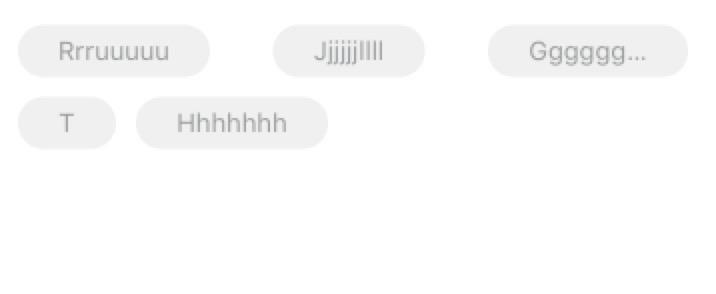

# YSColvCellSelfSizing

UICollectionViewCell大小自适应，并靠左/右对齐。

项目即是demo，直接跑起来即可。

## 重要步骤

1、UICollectionViewFlowLayout的prepare方法中设置预估itemSize

2、UICollectionViewCell重写方法preferredLayoutAttributesFitting，返回最新的Frame

3、UICollectionViewFlowLayout重写方法layoutAttributesForElements，重新排版，设置向左或向右对齐

## 关键代码

```swift
class Cell_colv: UICollectionViewCell {

    private lazy var btn:UIButton = {
        let v = UIButton()
        v.setTitleColor(UIColor.black, for: .normal)
        v.titleLabel?.font = UIFont.systemFont(ofSize: 16)
        v.backgroundColor = UIColor.lightGray
        v.layer.cornerRadius = 18
        v.layer.masksToBounds = true
        return v
    }()

    override init(frame: CGRect) {
        super.init(frame: frame)
        contentView.addSubview(btn)
        btn.translatesAutoresizingMaskIntoConstraints = false
        contentView.addConstraint(NSLayoutConstraint(item: btn, attribute: .top, relatedBy: .equal, toItem: contentView, attribute: .top, multiplier: 1, constant: 0))
        contentView.addConstraint(NSLayoutConstraint(item: btn, attribute: .bottom, relatedBy: .equal, toItem: contentView, attribute: .bottom, multiplier: 1, constant: 0))
        contentView.addConstraint(NSLayoutConstraint(item: btn, attribute: .leading, relatedBy: .equal, toItem: contentView, attribute: .leading, multiplier: 1, constant: 15))
        contentView.addConstraint(NSLayoutConstraint(item: btn, attribute: .trailing, relatedBy: .equal, toItem: contentView, attribute: .trailing, multiplier: 1, constant: -15))
}

    required init?(coder aDecoder: NSCoder) {
        fatalError("init(coder:) has not been implemented")
    }

    func setupData(title: String){
        btn.setTitle(title, for: .normal)
    }

    // 关键代码：重写此方法，返回最新frame
    override func preferredLayoutAttributesFitting(_ layoutAttributes: UICollectionViewLayoutAttributes) -> UICollectionViewLayoutAttributes {
        let att = super.preferredLayoutAttributesFitting(layoutAttributes)
        let string:NSString = (btn.title(for: .normal) ?? "") as NSString
        var newFram = string.boundingRect(with: CGSize(width: CGFloat(MAXFLOAT), height: btn.bounds.size.height), options: .usesLineFragmentOrigin, attributes: [
        NSAttributedString.Key.font : UIFont.systemFont(ofSize: 16)
        ], context: nil)
        newFram.size.height = 36
        newFram.size.width += 60
        att.frame = newFram
        return att
    }
}
```



```swift
class FlowLayout_colv: UICollectionViewFlowLayout {

    override func prepare() {
        super.prepare()
        guard let colV = collectionView else{
            return
        }
        scrollDirection = .vertical
        minimumInteritemSpacing = 8
        minimumLineSpacing = 16

        // 预估itemSize
        estimatedItemSize = CGSize(width: (colV.bounds.width - 8 * 2) / 3, height: 36)
    }

    // 向左对齐：正向遍历
    /*
    override func layoutAttributesForElements(in rect: CGRect) -> [UICollectionViewLayoutAttributes]? {
        guard let attrsArry = super.layoutAttributesForElements(in: rect) else {
            return nil
        }
        for i in 0..<attrsArry.count {
            if i < attrsArry.count - 1 {
                let curAttr = attrsArry[i] // 当前attr
                let nextAttr = attrsArry[i + 1]  // 下一个attr
                if curAttr.frame.minY == nextAttr.frame.minY { // 如果下一个在同一行则调整，不在同一行则跳过
                    if nextAttr.frame.minX - curAttr.frame.maxX > minimumInteritemSpacing{
                        nextAttr.frame.origin.x = curAttr.frame.maxX + minimumInteritemSpacing
                    }
                }
            }
        }
        return attrsArry
    }
    */

    // 向右对齐：倒序遍历
    override func layoutAttributesForElements(in rect: CGRect) -> [UICollectionViewLayoutAttributes]? {
        guard let colV = collectionView else {
            return nil
        }
        guard let attrsArry = super.layoutAttributesForElements(in: rect) else {
            return nil
        }
        for i in 0..<attrsArry.count {
            let j = attrsArry.count - 1 - i
            let curAttr = attrsArry[j]
            if j == attrsArry.count - 1{ // 最后一个向右对齐
                curAttr.frame.origin.x = colV.bounds.width - curAttr.frame.width
            } else{
                let nextAttr = attrsArry[j + 1]
                if curAttr.frame.minY == nextAttr.frame.minY { // 如果下一个在同一行则调整
                    if nextAttr.frame.minX - curAttr.frame.maxX > minimumInteritemSpacing{
                        curAttr.frame.origin.x = nextAttr.frame.minX - minimumInteritemSpacing - curAttr.frame.width
                    }
                } else{ // 如果下一个不在同一行，则当前的向右对齐
                    curAttr.frame.origin.x = colV.bounds.width - curAttr.frame.width
                }
            }
        }
        return attrsArry
    }
}
```


